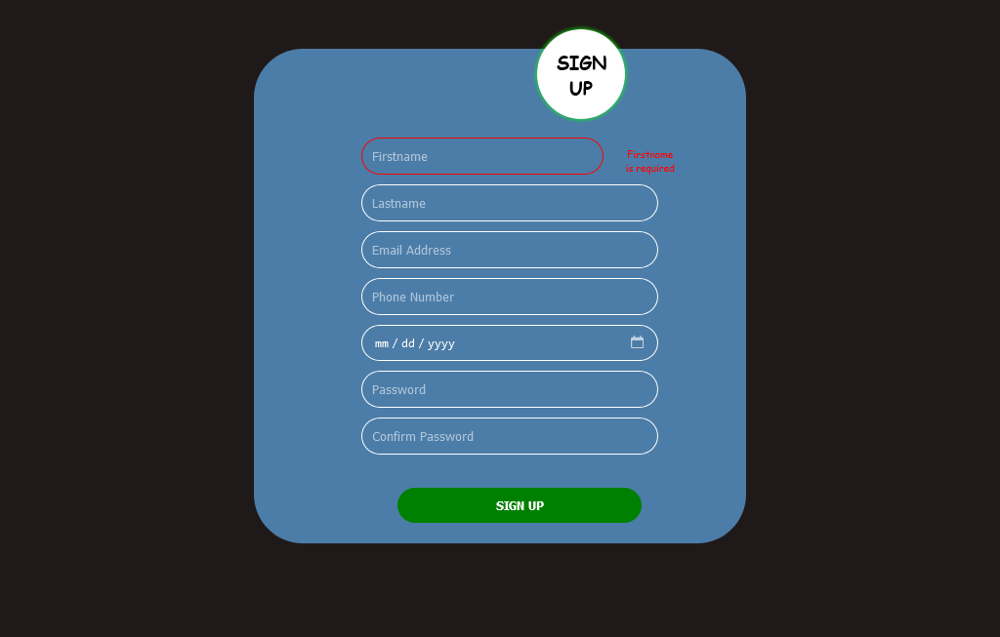

This website show JavaScript in action for client side form validation with HTML and CSS for the interface design.

Image below show the error message a user will get submit button is clicked without filling any field in the form.

